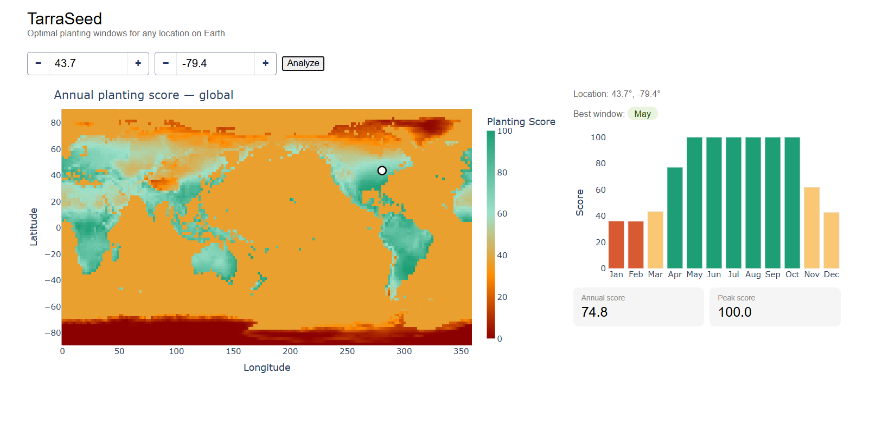

# TarraSeed 🌱

> Find the best time and place on Earth to plant greenery.

TarraSeed is an interactive data science project that predicts optimal planting windows for any location on Earth using 30 years of ERA5 climate data. It combines temperature, precipitation, soil moisture, and frost risk into a single planting score — then surfaces the best months to plant through an interactive global dashboard.



---

## What it does

Every patch of land has a window each year where conditions align for vegetation to take hold. TarraSeed finds that window. Search any location, pick a vegetation type, and get a month-by-month planting score backed by three decades of satellite and reanalysis climate data.

---

## Project Goals

- Download and process 30 years of ERA5 monthly climate data (1990-2020)
- Engineer a composite planting score from temperature, rainfall, soil moisture, and frost risk
- Train a scoring model validated against known reforestation success regions
- Build an interactive Plotly Dash dashboard to explore results globally

---

## Data Sources

| Dataset | Source | Variable |
|---|---|---|
| ERA5 Land monthly means | Copernicus CDS | 2m temperature, total precipitation |
| SMAP soil moisture | NASA Earthdata | Volumetric soil water |
| CHELSA bioclimate | Climatologies at High resolution | Frost days, growing degree days |

---

## Project Structure

```
terraseed/
├── data/
│   ├── raw/                        # Downloaded NetCDF files (not tracked by git)
│   └── processed/                  # Downsampled and cleaned arrays
├── models/                         # Saved trained scoring model
├── notebooks/
│   └── 01_explore.ipynb            # Data exploration
├── outputs/                        # Charts and maps for README
├── scripts/
│   ├── 01_download_era5.py         # Pull temperature and precipitation from CDS
│   ├── 02_download_smap.py         # Pull soil moisture from NASA
│   ├── 03_process.py               # Downsample, clean, build feature table
│   └── 04_train_model.py           # Train planting score model
├── app.py                          # Plotly Dash interactive dashboard
└── README.md
```

---

## Tech Stack

```
xarray       - multidimensional climate arrays (NetCDF)
rioxarray    - geospatial raster operations
pandas       - tabular feature engineering
scikit-learn - planting score model
plotly dash  - interactive web dashboard
cartopy      - geographic projections
cdsapi       - Copernicus CDS data download client
earthaccess  - NASA Earthdata access
```

---

## How to Run

```bash
# clone the repo
git clone https://github.com/bhavv04/terraseed.git
cd terraseed

# install dependencies
pip install xarray rioxarray netcdf4 cdsapi plotly dash scikit-learn xgboost seaborn earthaccess rioxarray

# set up CDS credentials (required for ERA5 download)
# create ~/.cdsapirc with your Copernicus API key
# see: https://cds.climate.copernicus.eu

# run the data pipeline in order
python scripts/01_download_era5.py
python scripts/03_process.py
python scripts/04_train_model.py

# launch the dashboard
python app.py
```

Open `http://localhost:8050` in your browser.

---

## The Planting Score

Each location gets a monthly score from 0 to 100 based on four variables:

| Variable | Weight | Why it matters |
|---|---|---|
| Temperature | 30% | Most vegetation needs 5-25°C to establish |
| Rainfall | 30% | Consistent moisture is critical in early growth |
| Soil moisture | 25% | Direct measure of water available to roots |
| Frost risk | 15% | Late frost kills newly planted seedlings |

The composite score is computed using a weighted Random Forest trained on coordinates of known successful reforestation projects globally.

---

## Dashboard Features

- Search any location by name or coordinates
- Select vegetation type: reforestation, crops, native shrubs, or grassland
- Global choropleth map colored by annual planting score
- Month-by-month planting calendar for the selected location
- Snapshot cards showing temperature, rainfall, soil moisture, and frost metrics
- Best planting window highlighted automatically

---

## References

- Hersbach et al. (2020). The ERA5 global reanalysis. Quarterly Journal of the Royal Meteorological Society.
- Entekhabi et al. (2010). The Soil Moisture Active Passive (SMAP) Mission. Proceedings of the IEEE.
- Copernicus Climate Data Store: https://cds.climate.copernicus.eu
- NASA Earthdata: https://earthdata.nasa.gov

---

